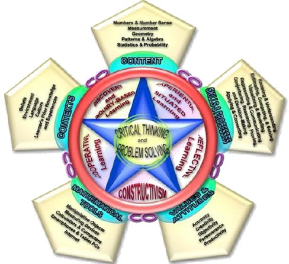

---
output:
  word_document:
    reference_docx: Research_CIA_my_style.docx
bibliography: StatEd.bib
csl: apa.csl
---
# Introduction

We encounter statistics and deal with it every now and then. Whether we are watching TV or reading the newspaper, we are confronted with statistical information in topics such as politics, economics, education, food, medicine, science and technology, sports, movies, public opinion, and social behavior. This is also true in our jobs and in the internet. We often than not make use of these information when we make choices and decisions. According to @franklin07, statistical literacy can aid us in our everyday personal choices. For example, when we decide to purchase a laptop, our knowledge in statistics would usually lead us to read and compare laptop specifications, reviews found in the internet and from colleagues, star ratings, and comments from those who purchased laptops. Otherwise, we end up buying a laptop that is not worth our money or a laptop that does not soothe our needs or even a laptop that is defective.

Government agencies also have statistics available for the public. These statistics are results from the analysis of their vast collection of data gathered in performing their operations. Board exam results, monthly number of dengue cases, the volume of traffic in highways during rush hours, monthly precipitation in millimeters, monthly income of households, population growth, the path of typhoons and national examination scores of elementary schools are just a few to mention. They also make use of various statistical methods to visualize, understand, learn and infer patterns, groupings, and behaviors from these data which are useful in creating statistical models, systems and solutions that will aide government and individual decision making. Statistics paves the way for effective and efficient evidence-based policies which the government uses in pursuing its core responsibilities of economic prosperity, security, social cohesion and environmental sustainability [@fs14].

Moreover, science and technology has evidently improved our lives. Information is easily available in the internet using our smartphones. Medical care and procedures have improved. Artificial intelligence is now being used in our computers and devices to give us ease of access. The list goes on. Statistics ensures effectiveness and efficiency of inventions and discoveries. This is the reason why statistics plays an immeasurable role in the development of science and technology.

Hence, statistical literacy is a very important factor in the growth and development of a country. According to Steen (2001), statistical literacy “empowers people by giving them tools to think for themselves, to ask intelligent questions of experts, and to confront authority confidently. These are skills required to survive in the modern world” [as cited in @franklin07, p. 3].  Statistical literacy is of the essence and statistics education plays a very big role in instilling statistical literacy to individuals. It is in this regard that @franklin07 emphasized that statistical literacy should be developed beginning in the elementary grades and strengthened through high school. She pointed out also that investing in statistical literacy is investing in the economic future of one's nation and in the well-being of individuals.

This paper will define the current statistics education in the K to 12 curriculum of the Department of Education (DepEd) in the Philippines and its counter parts in Australia and the United States of America. It will also discuss how the Philippine's statistics education curriculum compare with the two countries' curriculum. It will also discuss established standards in implementing statistics education in the K to 12 curriculum.

# Presentation of Cases

## Statistics Education in the Philippines

Statistics in the K to 10 in the Philippines is under the mathematics curriculum. According to its framework discussed by @cg16, the goal of mathematics are Critical thinking and Problem solving. The framework is shown in figure 1. To achieve these goals, mathematics education has five aspects: an organized and rigorous curriculum content, a well-defined set of high-level skills and processes, desirable values and attitudes, and appropriate tools, taking into account the different contexts of Filipino learners. 

The mathematics curriculum is grounded in the following theories: Experiential and Situated Learning, Reflective Learning, Constructivism, Cooperative Learning and Discovery and Inquiry-based Learning. It adopted five content strands from @SM11: Numbers and Number Sense, Measurement, Geometry, Patterns and Algebra, and Probability and Statistics. Statistics and Probability as a subject encompasses developing skills in collecting and organizing data using charts, tables, and graphs; understanding, analyzing and interpreting data; dealing with uncertainty; and making predictions about outcomes. Concepts and skills are presented with increasing levels of complexity from one grade level to another in spiral progression facilitating for deeper understanding of core concepts. The mathematics curriculum in general provides a solid foundation for mathematics in Senior High School and also provides necessary concepts and life skills needed by Filipino learners continuing as learners and as citizens of the Philippines [@cg16].

The @cg16 explicitly presented that Statistics and Probability is taught from Kinder to Grade 12 except in Grade 9. The Subject is not taught in Grade 9. The Grade Level Standards for the strand Statistics and Probability is presented as follows: At the end of Kinder, the learner demonstrates understanding and appreciation of key concepts, skills, and principles involving data collection and tables. At the end of Grade 1, tables, pictographs, and outcomes. For Grade 2, same topics as for Grade 1. For Grade 3, tables, bar graphs, and outcomes. For Grade 4, tables, bar graphs and simple experiments. For Grade 5, tables, line graphs, and experimental probability. For Grade 6, tables, pie graphs, and experimental and theoretical probability. For Grade 7, data collection and presentation, and measures of central tendency and variability. For Grade 8, probability of simple events. For Grade 10, combinatorics and probability, and measures of position. These key concepts, skills and principles are learned, understood and appreciated as applied -- using appropriate technology -- in problem solving, critical thinking, communicating, reasoning, making connections, representations, and decisions in real life [@cg16].

The @cg16 also explicitly presented the teaching and learning of Statistics and Probability in Grade 1 until Grade 8 and in Grade 10. From Grade 1 until Grade 6, Statistics and Probability is taught in the 4th quarter together with the strand Measurement. In Grade 5, learners will start using a scientific calculator. In Grade 7, the subject is taught in the entire 4th quarter. Starting Grade 7, teaching and learning the subject is aided with learning materials. However, the subject is taught in the 4th quarter together with the Strand Geometry in Grade 8. In Grade 10, the subject is covered in the 3rd and 4th quarter.

In the Senior High School, there is a core Statistics and Probability course [@cg13]. It is offered in all the academic tracts. The course is offered either in Grade 11 or Grade 12 depending on the academic tract of the learner. The curriculum guide stipulates that at the end of the course, the learners must know how to find the mean and variance of a random variable, to apply sampling techniques and distributions, to estimate population mean and proportion, to perform hypothesis testing on population mean and proportion, and to perform correlation and regression analyses on real-life problems. The course will cover random variables and probability distributions, normal distribution, test of hypothesis. Topics on correlation and regression analysis are included to enrich the course.

## Statistics Education in Australia

# Summary and Conclusion
 
# References