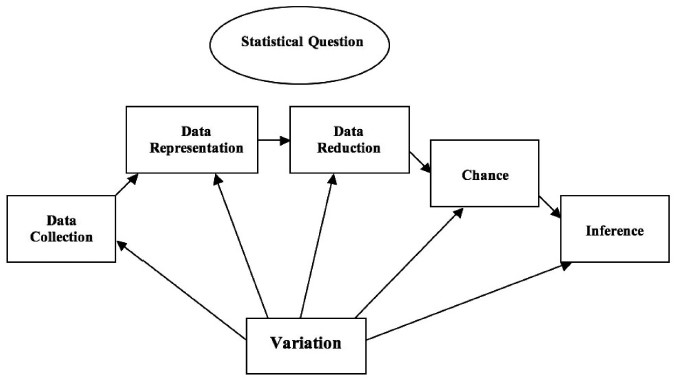

# Introduction

Statistical literacy as defined by Wallman (1993) is "the ability to understand and critically evaluate statistical results that permeate our daily lives – coupled with the ability to appreciate the contributions that statistical thinking can make in public and private, professional and personal decisions" [as cited by @watson11]. Statistical literacy is very important to people in this ICT driven world we live in. Due to advances in technology, information is easily available and the need to use this information to guide decision making is inevitable to everyone. According to Steen (2001), statistical literacy “empowers people by giving them tools to think for themselves, to ask intelligent questions of experts, and to confront authority confidently. These are skills required to survive in the modern world” [as cited in @franklin07, p. 3]. With that said, @franklin07 continued to point out that investing in statistical literacy is investing in the economic future of the nation and the well-being of individuals.

To advance statistical literacy, statistics education plays a big role. To improve the quality of statistics education, the government and education institutions have a lot to contribute.

# Presentation of Cases

The study of @reston10 entitled, *Statistical Literacy Assessment and Training of Government Personnel Using Data From National Statistics Office: Philippine Context* talks about the Philippine government partnering with higher education institutions (HEIs) in an effort to strengthen statistical capability of government personnel. In the Central Visayas region, the National Statistical Coordination Board (NSCB) -- the agency in-charge in policy-making and coordination on statistical matters in the country-- with its Statistical Research and Training Center (SRTC) together with regional offices of the National Economic Development Authority (NEDA) and selected HEIs in the region came up with a Memorandum of Agreement to upgrade statistical capabilities through conducting of trainings for government personnel in-charge with data analysis and planning. The author was involved in these trainings through the Regional Statistical Coordination Committee (RSCC) under the NSCB.

In a training program on Basic Statistics with Microsoft Excel during the period of June-July 2009, @reston10 assessed specific statistical literacy skills demonstrated among the participants by using a 15-item Statistical Literacy Assessment Scale (SLAS) which served as a pre-test. The items in the SLAS were data generated by the National Statistics Office (NSO) to reflect different context for assessing statistical literacy. After that, Watson's (2007) framework of statistical literacy was used to analyze the SLAS scores of the respondents to determine their level of statistical literacy. These levels are as follows: (1) idiosyncratic-personal engagement with context using basic graph/table reading skills; (2) colloquial-informal engagement with context using basic chance, graph, and numeracy skills; (3) selective engagement with context involving qualitative interpretation of statistical ideas; (4) appropriate non-critical engagement with context using basic statistical skills; (5) critical-questioning engagement with context using appropriate statistical terminology; and (6) critical-questioning engagement with context using sophisticated mathematical-statistical understanding. The training participants comprise 56 government personnel involved in data management and analysis for local and regional development planning, as well as for policy review and formulation. The items in the SLAS were discussed during the training. Post assessment was done in the form of performance-based activities where participants were given six data sets in table format from NSO and were required to either interpret the table or construct graphical displays from the given data in the tables.

The study found out that most of the participants are either in level 1 or level 2 at the beginning of the training. It is in the post assessment that some participants have demonstrated level 3 and a few have even demonstrated critical-questioning engagement with context using appropriate statistical terminology which is level 5. In conclusion, the study pointed out the important role of the NSO in providing data in various contexts as basis for statistical literacy assessments among government personnel. The study saw that there is a need to improve statistical literacy level of government personnel using data from various contexts, including those used in their workplace. She suggested that efforts to strengthen ties and collaboration among data providers and data users and consumers, as well as statistics educators, is extremely needed as a valuable step towards promoting statistical literacy among the citizens. It is recommended in the study that statistical capability building programs among government personnel and other professionals be developed and sustained, and that university programs in statistics for non-majors should address the development of statistical literacy needed for professionals in a wide variety of work settings.

In the study of @jala14 entitled *Sustaining Student Engagement in a College Statistics Course Through a Reflective Teaching Model Using Youth Statistics*, it was pointed out that after finishing a college statistics course, students still lack understanding on how to connect concepts to different disciplines and fail to recognize statistical procedures in solving real problems on data analysis. They also pointed out that even graduate students have misconceptions of some statistical terms; a result of poor from poor background knowledge on inferential statistics in their undergraduate statistics courses. It only shows that teaching and learning of statistics in college is just for the sake of assessment and passing the course [@jala14]. In this regard, they stressed that teaching of statistics should be more relevant and responsive and therefore offer students a meaningful experience so that they can use what they have learned in their daily context; sustaining their learnings. 

The study of @jala14 focused on making students connect their learnings in statistics and connect them with real life scenarios and to sustain their understanding of statistics concepts through exposure and engagement to youth statistics and the use of reflective teaching model. The study uses qualitative method. It analyzes students' activities and their critical reflections about the activity which they wrote in portfolios to check the extent of their understanding of statistics concepts. Participants of the study are 14 students in a basic statistics course who are enrolled summer of 2014 in a non-sectarian university located in Mandaue City, Cebu, Philippines. Of these participants, three (3) are males and eleven (11) are females. One (1) student is in the second year level, eight (8) are in their third year level and five (5) are in their fourth year level or are graduating students. Thirteen (13) of them are from the College of Business and Accountancy and one (1) from the College of Customs Administration. Five (5) of them are working or are engaged in their own small business in a nearby market and the rest are full-time students. The Survey of Attitude toward Statistics - 28 (SATS-28 ©) was administered to the study participants before the start of classes to assess their attitudes towards statistics. It is a 28-item, 7-point Likert type -- higher scores corresponds to more positive attitude -- tool with four components; namely affect, cognitive competence, value and difficulty. Their portfolios were submitted at the end of the summer classes. Written extent of their understanding of the concepts they learned which assessed using a scoring rubric.

Results of the SATS© 28 showed that students although they are afraid with statistics, they think that statistics will would help them in their everyday and future endeavors, giving them advantage over those who don't know how to do statistics. Results of the reflective activities of the students showed that there were misconceptions of concepts, only one student can connect concepts to daily undertakings, and the rest cannot even read and understand data presented in tables in some of their activities. However, they actively participated in the modular contextualized data-based learning activities since data under study are data sets on youth statistics from different disciplines and social life. This motivated them to learn and sustain their learnings since they can relate to their data. With these findings, the study pointed out the importance of assessing students' beliefs and attitudes before and after the course to see whether there is a change in attitude after exposure to contextualized data-based learning activities. Moreover, the study suggests a more extensive portfolio assessment will be used for students to reflect on their learning with data and for the teacher to assess their understanding of statistical concepts and to develop statistical literacy skills.

@chance07

@langcauon18

@reston16

@reston18

@jala14 

@reston11

In discussing statistical literacy, it is noteworthy to discuss the study of @watson11 entitled, *Foundations for Improving Statistical Literacy*. In her quest to forward and improve statistical literacy, she pointed out that variation which is the very essence of doing statistics is not given priority in the teaching of statistics. She argued that building the foundation of statistical literacy need not to be accompanied by complex calculations and theoretical assumptions but by understanding that probability associated to sampling and variation is included in the process of doing statistical investigation. Thus, she suggested two models that are critical in developing statistical understanding. The first model shows the relationship of five components in answering a statistical question considering variation in each component; data collection, data representation, data reduction, chance, inference. Figure 1 shows this model. The second model is for planning and implementation of programs that would lead to the development of statistical literacy. It is a three level model for statistical literacy; terminology, context, critical thinking. The first tier focuses on understanding and familiarization of statistical terminologies used in statistical reasoning and decision-making. The second focuses on the applications to societal concerns of this statistical language. The third focuses on critical thinking that enables people to challenge vague claims and statements. According to her, this setting does not necessarily mean that one is a prerequisite of the next but each one complements each other.

Furthermore, @watson11 discussed the models' implementation by considering the different structure of responses from learners when asked various contextual statistical questions. These structures are prestructural, unistructural, multistructural, and relational. Being aware of these responses facilitates in building classroom experiences, serves as a meaningful basis for 

developing concepts through the second model with regards to the first model; ensuring the attainment of critical thinking [@watson11]. She goes on by suggesting that statistical questions relating to cause-effect claims from the media are most effective to attain critical thinking and that this approach can be applied to adult learners since it can be appealing to them.

Moreover, having discussed previous studies on gauging statistical literacy which concluded that most students work consistently in context and few attain critical thinking, @watson11 concluded that statistical literacy is very important in the curriculum. She added that the need for context to provide learning experiences for statistical literacy establishes a connection with and its importance to other areas in the curriculum. Thus, statistical literacy should be included in the cross-curriculum part of the overall curriculum and should be explicitly stated [@watson11]. She finally suggests that critical thinking statistical literacy can be a tool to achieve literacy and numeracy across the curriculum. 

@franklin07 @GCR16

# Summary and Conclusion

# References