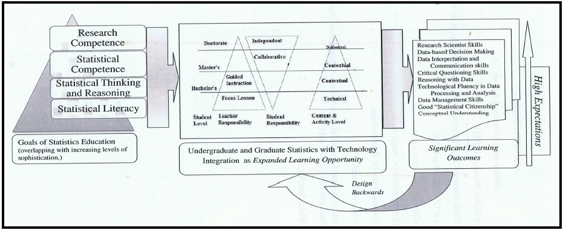

# Introduction

Statistical literacy as defined by Wallman (1993) is "the ability to understand and critically evaluate statistical results that permeate our daily lives – coupled with the ability to appreciate the contributions that statistical thinking can make in public and private, professional and personal decisions" [as cited by @watson11, p.197]. Statistical literacy is very important to people in this ICT driven world we live in. Due to advances in technology, information is easily available and the need to use this information to guide decision making is inevitable to everyone. According to Steen (2001), statistical literacy “empowers people by giving them tools to think for themselves, to ask intelligent questions of experts, and to confront authority confidently. These are skills required to survive in the modern world” [as cited in @franklin07, p. 3]. With that said, @franklin07 continued to point out that investing in statistical literacy is investing in the economic future of the nation and the well-being of individuals.

To advance statistical literacy, statistics education plays a big role. To improve the quality of statistics education, the government and education institutions have a lot to contribute.

# Presentation of Cases

The study of @reston10 entitled, *Statistical Literacy Assessment and Training of Government Personnel Using Data From National Statistics Office: Philippine Context* talks about the Philippine government partnering with higher education institutions (HEIs) in an effort to strengthen statistical capability of government personnel. In the Central Visayas region, the National Statistical Coordination Board (NSCB) -- the agency in-charge in policy-making and coordination on statistical matters in the country-- with its Statistical Research and Training Center (SRTC) together with regional offices of the National Economic Development Authority (NEDA) and selected HEIs in the region came up with a Memorandum of Agreement to upgrade statistical capabilities through conducting of trainings for government personnel in-charge with data analysis and planning. The author was involved in these trainings through the Regional Statistical Coordination Committee (RSCC) under the NSCB.

In a training program on Basic Statistics with Microsoft Excel during the period of June-July 2009, Reston assessed specific statistical literacy skills demonstrated among the participants by using a 15-item Statistical Literacy Assessment Scale (SLAS) which served as a pre-test. The items in the SLAS were data generated by the National Statistics Office (NSO) to reflect different context for assessing statistical literacy. After that, Watson's (2007) framework of statistical literacy was used to analyze the SLAS scores of the respondents to determine their level of statistical literacy. These levels are as follows: idiosyncratic-personal engagement with context using basic graph/table reading skills; colloquial-informal engagement with context using basic chance, graph, and numeracy skills; selective engagement with context involving qualitative interpretation of statistical ideas; appropriate non-critical engagement with context using basic statistical skills; critical-questioning engagement with context using appropriate statistical terminology; and critical-questioning engagement with context using sophisticated mathematical-statistical understanding. The training participants comprise 56 government personnel involved in data management and analysis for local and regional development planning, as well as for policy review and formulation. The items in the SLAS were discussed during the training. Post assessment was done in the form of performance-based activities where participants were given six data sets in table format from NSO and were required to either interpret the table or construct graphical displays from the given data in the tables.

The study found out that most of the participants are either in level 1 or level 2 at the beginning of the training. It is in the post assessment that some participants have demonstrated level 3 and a few have even demonstrated critical-questioning engagement with context using appropriate statistical terminology which is level 5. In conclusion, the study pointed out the important role of the NSO in providing data in various contexts as basis for statistical literacy assessments among government personnel. The study saw that there is a need to improve statistical literacy level of government personnel using data from various contexts, including those used in their workplace. She suggested that efforts to strengthen ties and collaboration among data providers and data users and consumers, as well as statistics educators, is extremely needed as a valuable step towards promoting statistical literacy among the citizens. It is recommended in the study that statistical capability building programs among government personnel and other professionals be developed and sustained, and that university programs in statistics for non-majors should address the development of statistical literacy needed for professionals in a wide variety of work settings.

In the study of @jala14 entitled *Sustaining Student Engagement in a College Statistics Course Through a Reflective Teaching Model Using Youth Statistics*, it was pointed out that after finishing a college statistics course, students still lack understanding on how to connect concepts to different disciplines and fail to recognize statistical procedures in solving real problems on data analysis. They also pointed out that even graduate students have misconceptions of some statistical terms; a result of poor from poor background knowledge on inferential statistics in their undergraduate statistics courses. It only shows that teaching and learning of statistics in college is just for the sake of assessment and passing the course [@jala14]. In this regard, they stressed that teaching of statistics should be more relevant and responsive and therefore offer students a meaningful experience so that they can use what they have learned in their daily context; sustaining their learnings. 

The study of Jala and Reston focused on making students connect their learnings in statistics and connect them with real life scenarios and to sustain their understanding of statistics concepts through exposure and engagement to youth statistics and the use of reflective teaching model. The study uses qualitative method. It analyzes students' activities and their critical reflections about the activity which they wrote in portfolios to check the extent of their understanding of statistics concepts. Participants of the study are 14 students in a basic statistics course who are enrolled summer of 2014 in a non-sectarian university located in Mandaue City, Cebu, Philippines. Of these participants, three are males and eleven are females. One student is in the second year level, eight are in their third year level and five are in their fourth year level or are graduating students. Thirteen of them are from the College of Business and Accountancy and one from the College of Customs Administration. Five of them are working or are engaged in their own small business in a nearby market and the rest are full-time students. The Survey of Attitude toward Statistics - 28 (SATS-28 ©) by Schau (2003) was administered to the study participants before the start of classes to assess their attitudes towards statistics. It is a 28-item, 7-point Likert type -- higher scores corresponds to more positive attitude -- tool with four components; namely affect, cognitive competence, value and difficulty. Their portfolios were submitted at the end of the summer classes. Written extent of their understanding of the concepts they learned which assessed using a scoring rubric.

Results of the SATS© 28 showed that students although they are afraid with statistics, they think that statistics will would help them in their everyday and future endeavors, giving them advantage over those who don't know how to do statistics. Results of the reflective activities of the students showed that there were misconceptions of concepts, only one student can connect concepts to daily undertakings, and the rest cannot even read and understand data presented in tables in some of their activities. However, they actively participated in the modular contextualized data-based learning activities since data under study are data sets on youth statistics from different disciplines and social life. This motivated them to learn and sustain their learnings since they can relate to their data. With these findings, the study pointed out the importance of assessing students' beliefs and attitudes before and after the course to see whether there is a change in attitude after exposure to contextualized data-based learning activities. Moreover, the study suggests a more extensive portfolio assessment will be used for students to reflect on their learning with data and for the teacher to assess their understanding of statistical concepts and to develop statistical literacy skills.

The K to 12 Basic Education Curriculum of the Department of Education (DepEd) has sought to develop critical thinking and problem solving as goals for teaching mathematics. Furthermore, one learning principle and theory supporting the realization of these goals is cooperative learning.  It is in this regard that @langcauon18 conducted the study entitled *Using Activity-Based Cooperative Learning Materials to Develop High School Students' Critical Thinking and Problem Solving Skills in Statistics and Probability.* 

The study investigated the use of activity-based cooperative learning materials in developing critical thinking and problem solving skills among Grades 7 and 8 students in Statistics and Probability -- a learning domain in the K to 12 mathematics curriculum -- using quasi-experimental pretest-posttest design. Activity-based cooperative learning materials were used to teach the topics Variability and Simple Probability of Events to Grades 7 and 8 classes respectively. Pre- and post-assessments of critical thinking and problem solving skills were administered to the students in the two groups to determine if there is significant difference between results. The implementation of the lesson using the ABCLM was done within the 4th quarter of AY 2016-2017 where the Statistics and Probability learning domain was indicated in the K to 12 Mathematics Curriculum Guide. The classes for the experimental groups were one intact Grade 7 class with 46 students and one intact Grade 8 class with 35 students. These classes were taught by teachers who participated in a Statistics and Probability workshop using the activities. The researchers adopted the Levels of Problem Solving Guide by Adamovic and Hedden (1997) which categorizes the student's problem solving skills into six levels: non-analytical stage, number writing stage, symbol association stage, early analytical stage, simple analytical stage, and complex analytical stage. They also adapted Scoring Guides, to evaluate students' output in both pre- and post-assessments. The scoring guides for the test in Statistics and test in Probability have different criteria with a total of 20 points per test. The critical thinking scores consisted of two components in terms of: accuracy or correctness of answer; and reasoning or explanation that justifies their answers. The problem solving scores also consisted of two components: correctness of answer; and solution.

Results of the study imply that the use of ABCLM helped improve students' reasoning/explanation and the total critical thinking score. It also imply that the use of ABCLM has a positive effect of improving the way students solve problems and the level of problem solving performance of students. The results of the study indicated using activity-based cooperative learning materials in teaching Statistics and Probability lessons had the potential to develop students critical thinking and problem solving skills as they collaboratively and actively engage in real data sets to evaluate and make choices or solve problems.

In an attempt to find out factors that would explain the low and failing grades of Statistics 11 students at Benguet State University, the study of @valentin18 entitled *Factors Affecting Performance in Statistics of Benguet State University College Students* employed principal component analysis and path analysis to extract the unique latent factors on the attitudes towards statistics and to measure the effects of the extracted component of the attitudes of the students towards statistics, academic performance and selected profile variables respectively. There were two hundred eighty-eight respondents and they are all Benguet State University college students enrolled in Basic Statistics on the first semester of school year 2016-2017. A survey questionnaire was administered to the respondents; the Survey of Attitude toward Statistics - 28 (SATS-28 ©) by Schau (2003) and ATS by Wise (1985). Personal and academic profile of the students were also gathered.

As a result of the study, five components were extracted and labeled as “affective” (feelings towards statistics), “interest” (interest for knowledge and activities in statistics), “value” (perceived usefulness of the subject personally and professionally), “difficulty” (considers the difficulty of the subject), and “social” (interest for group discussion about the subject). Another result is that performance in mathematics have a positive direct effect on students' performance in statistics. According to the researchers, Math 11 or College Algebra is a prerequisite of Statistics 11. In addition, the result in which students’ course also has a direct effect on their performance. According to the researchers, this implies that the difference in the performance of the students depends on the relation or relevance of the subject to their course. The study also found out that belief of the students on the value of statistics personally and professionally has a positive direct effect on their performance in the subject. According to the researchers, this implies that the more students think that statistics is relevant to them and to their profession, the more they will take the subject seriously and will get a higher performance. Finally, the study saw that belief on the difficulty similarly has a direct positive effect on the performance of the students. Believing that the subject is difficult make the students do their best to understand it and rather perform better [@valentin18].

Statistical information produced by an increasing number of public agencies and private organizations play an essential role in enabling citizens to develop awareness and capability to react intelligently and critically to various social, political, economic phenomena; the relevance of social context is an important consideration in choosing real data for teaching statistical concepts and processes [@reston16]. The Philippines has just implemented its K to 12 curriculum in 2012. Statistics and Probability is a content strand under the mathematics curriculum for Kinder up to Grade 10 and is taught in spiral progression. Nonetheless, in the senior high school mathematics curriculum, there is a stand alone Statistics and Probability core subject with 80 hours time allotment. Responding to the challenge of implementing the Statistics and Probability subject in the senior high school, @reston16 endeavored to developed curriculum resource materials in a course disk anchored on inquiry-based constructivist pedagogy using real data about the youth sector in their study entitled *Promoting Statistical Literacy and Understanding of Youth Population Dynamics in a New Statistics and Probability Course for Senior High School*. The study also endeavored in striking a balance between global standards in teaching statistics and the local situation, needs and resources available.

Data from the Philippine Statistical Authority (PSA), the 2011 Project Youth Survey conducted by Social Weather Station (SWS), and data on basketball players in the Philippine Basketball Association were integrated in the teaching and learning activities. To provide international perspective, data from the Minnesota Population Center, Integrated Public Use Microdata Series (IPUMS) and the European Commission, Eurostat Databases on Youth Statistics were also used. Variables of interest in these databases include youth population demographics, education and training, employment, health, social inclusion, participation, volunteering and youth in the digital world. These data sets are stored in Microsoft Excel spreadsheets. It is by letting students work on real data about the youth population in activities that statistical literacy skills are developed and a deeper understanding of their characteristics and vital role in society and national development is promoted [@reston16].

The activity resource book developed in the study is a focused on relevant teaching-learning assessment activities which are constructively aligned with the content and performance standards, target learning competencies, and assessment in the SHS Statistics and Probability curriculum guide. The activities follow inductive teaching and learning approaches where instead of beginning with general theories and principles, instruction begins with a scenario -- a set of observations or data set to interpret, a case study to analyze, or a real data-based problem to solve, leading to applications. Moreover, the design of the material adheres to the principles of constructive alignment, curricular connection and relevance, “glocalization” and use of social context.

The study came up with a disk with all the data sets and activities and concluded that the proposed course materials will provide a springboard for developing statistical literacy skills and competencies among young people to meet the demands of 21st century society. However, the researchers also saw that the practicality of implementing them in technology-enabled statistics classrooms will have to be addressed foremost. According to Reston (2015), several issues in teaching Statistics and Probability with technology integration are: access to a school computer laboratory for statistics classes; teachers’ capacity for technology integration; teachers’ pedagogical content knowledge on the topics upon which these activities are anchored [cited in @reston16]. In this regard, the researchers suggested a FLIPPED classroom model where students explore the disk with some directions and guiding questions before class time so that during class time the focus is on discussion and follow-up activities that connect students’ knowledge of the lesson with the data and statistical concepts and methods.

The landscape of statistics education is ever changing and is brought about by national reforms in the education system, the emerging global standards and desired learning outcomes for students, and this ICT laden world. After the implementation of the K to 12 curriculum in 2012, Reston (2015) found out that for mathematics teachers, the teaching of Statistics and Probability is the learning area with greatest need for professional growth in terms of their pedagogical content knowledge for teaching the subject using the spiral progression approach [cited in @reston18]. @reston18 identified and worked on the need to re-conceptualized teachers’ professional development to enhance teachers’ professional knowledge bases, including curriculum knowledge, for better implementation of a reformed statistics and probability education in the Philippine in their study entitled *Improving Statistical Pedagogy Among K to 12 Mathematics Teachers in the Philippines*. 

The study is actually is an ongoing five-year project of the University of San Carlos (USC) in Cebu City, Philippines with expert support from Academics without Borders (AWB), a nongovernmental organization based in Montreal, Canada. It aims to: enhance teachers’ pedagogical content knowledge (PCK) for teaching statistics across the newly implemented K to 12 Basic Education curriculum in the Philippines; assist in the development of materials that can be used in workshops for practicing teachers; develop a support structure for practicing teachers which could include online support. The project is implemented in three phases. Phase 1 of the project comprises one year capacity building of workshop facilitators along with the development of activities for the workshops. Phase 2 of the project consists of the on-going implementation of workshop-based courses held in parallel sessions for elementary, junior and senior high school math teachers. Phase 3 is not mentioned in the study.

As a result of phase 1 and phase 2, The design of a more coherent, needs-based teacher development program for Mathematics teachers was conceptualized with some degree of flexibility to cater to different aspects of teaching the Statistics and Probability learning domain. The teacher development program is workshop-based and was designed to connect teachers’ needs and current practices with the pedagogical approaches of the K to 12 mathematics curriculum with the activities as venues for students to develop conceptual understanding and the stipulated learning competencies in the curriculum [@reston18]. According to the researchers, The next step includes institutionalization of the implementation of the workshops as part of the university’s certificate programs for continuing professional development of the teachers. They will also follow-up the participants on their implementation on their own classes and provide support and mentoring through an action research approach for sustained professional development of teachers and improvement of teaching practice. They will also build a website for those who participated with the purpose of online support in terms of resources, and peer feedback and interactions.
  
In discussing statistical literacy, it is noteworthy to discuss the study of @watson11 entitled, *Foundations for Improving Statistical Literacy*. In her quest to forward and improve statistical literacy, she pointed out that variation which is the very essence of doing statistics is not given priority in the teaching of statistics. She argued that building the foundation of statistical literacy need not to be accompanied by complex calculations and theoretical assumptions but by understanding that probability associated to sampling and variation is included in the process of doing statistical investigation. Thus, she suggested two models that are critical in developing statistical understanding. The first model shows the relationship of five components in answering a statistical question considering variation in each component; data collection, data representation, data reduction, chance, inference. Figure 1 shows this model. The second model is for planning and implementation of programs that would lead to the development of statistical literacy. It is a three level model for statistical literacy; terminology, context, critical thinking. The first tier focuses on understanding and familiarization of statistical terminologies used in statistical reasoning and decision-making. The second focuses on the applications to societal concerns of this statistical language. The third focuses on critical thinking that enables people to challenge vague claims and statements. According to her, this setting does not necessarily mean that one is a prerequisite of the next but each one complements each other.

Furthermore, Watson discussed the models' implementation by considering the different structure of responses from learners when asked various contextual statistical questions. These structures are prestructural, unistructural, multistructural, and relational. Being aware of these responses facilitates in building classroom experiences, serves as a meaningful basis for 

developing concepts through the second model with regards to the first model; ensuring the attainment of critical thinking [@watson11]. She goes on by suggesting that statistical questions relating to cause-effect claims from the media are most effective to attain critical thinking and that this approach can be applied to adult learners since it can be appealing to them.

Moreover, having discussed previous studies on gauging statistical literacy which concluded that most students work consistently in context and few attain critical thinking, Watson concluded that statistical literacy is very important in the curriculum. She added that the need for context to provide learning experiences for statistical literacy establishes a connection with and its importance to other areas in the curriculum. Thus, statistical literacy should be included in the cross-curriculum part of the overall curriculum and should be explicitly stated [@watson11]. She finally suggests that critical thinking statistical literacy can be a tool to achieve literacy and numeracy across the curriculum. 

Technology integration plays a crucial role in statistics education. It offers expanded opportunities for students to achieve significant learning outcomes. Moreover, it facilitates and improves the learning of statistical concepts. It reduces computational load and aids in visualization. It equips students with relevant and effective tools they can use in doing statistics in their future jobs. Technology integration bridges the gap between statistics education and the practice of statistics in this modern and information driven world. 

In the article *An Outcome-Based Framework for Technology Integration in Higher Education Statistics Curricula for Non-Majors*, @reston13 posits that non-major undergraduate and graduate statistics course in the Philippines are treated independently with no framework for organization to facilitate the transition from undergraduate to graduate-level statistics. To address this issue and in an attempt to integrate technology in these courses; she discussed and presented a categorization of available technologies for expanded opportunities for successful learning of statistics and probability, then provided a mapping out of the goals and intended learning outcomes for teaching statistics as basis for designing learning experiences with technology, and finally presented a framework that combines ideas of Pearson and Gallagher’s Gradual Release of Responsibility Model (1993) and Taggart’s (2005) Model of Reflective Thinking as a way of organizing learning experiences that provide expanded learning opportunities with technology.

The study categorized technology in statistics education as statistical software packages, educational software, spreadsheets, applets/standalone applications, graphing calculators, multimedia materials, course management systems, personal response systems, and data repositories. Reston adds that in the Philippines, statistical software packages and spreadsheets, mainly, Microsoft Excel, are often referred to when a teacher speaks of technology tools for teaching statistics despite the wide range of technology resources available worldwide.

Furthermore, the study mapped out goals for undergraduate and graduate statistics education vis-á-vis intended learning outcomes and the role of technology in designing learning experiences. For undergraduate statistics education, the goals are: develop statistical literacy, develop statistical thinking and reasoning, develop data-handling and analysis skills, and a culminating student outcome -- good statistical citizenship. For graduate statistics education, the goals are: develop higher levels of statistical literacy, critical thinking and reasoning; develop statistical competence; develop research scientist skills; and a culminating student outcome -- statistical and research competence.

In response to the need for a coherent and vertically articulated curricula for statistics courses from undergraduate to graduate level, Reston came up with an outcome-based organizing framework. Figure 2 shows this framework. She says that the framework could serve as a guide for statistics educators and administrators in designing and implementing a more relevant, responsive and transformative statistics curriculum. The framework shows that the goals of statistics education are side by side with the intended learning outcomes for students. Designing backwards, is also applied in the design of learning activities with extended opportunities for successful learning primarily driven by technology. In parallel, the framework includes the Reflective Thinking Model by Taggart (2005) which corresponds to the levels of technology integration. The framework suggests that all educational decisions are made based on how to best  facilitate the desired student outcomes.

In conclusion, the study provides a guide for a coherent and outcome-based
statistics education that focuses on the attainment of significant learning outcomes.
Reston adds that the framework is grounded on the goals of statistics education and uses the principles of outcome-based education and other sound educational models to map out the desired learning outcomes expected of professionals in this age of information and the corresponding role of technology in designing significant learning experiences geared towards the attainment of these outcomes. She recommends that the reality of Philippine conditions in terms of available physical facilities, teacher preparation in technology integration and other administrative barriers need to be considered and addressed.

The article *Sustaining Teachers' Capacity For Teaching Statistical Inference Through Reflective Practice*  by @reston14  pointed out  new teaching strategies in statistics. The paper used qualitative design to elicit the journey of college statistics teachers in teaching statistical inference in selected 28 college universities in Cebu City. Using Taggart’s Reflective Thinking Model (2005), the authors revolved their study with the teachers’ reflective thinking levels namely technical, contextual and dialectical.

Contextualizing teaching statistics in the Philippines, the authors emphasized the dominance of traditional formula-based and computational methods for teaching probability and hypothesis testing with little or no coverage in sampling distributions and estimation of parameters traditional methods of teaching. Though the authors recognized  the efforts of  the Philippines to make use of local-based and contextualized pedagogical skills in teaching inferential statistics through workshops, local for a and context-based publications, they also pointed that there is need for statistics teachers to explore their own conceptions on statistical inference and their teaching practice on the topic as basis for more focused and improved instructional decisions and actions.  Thus, in situating their study, Reston and Jala argued that teachers need to develop reflective thinking skills in order to model and sustain reflective practice.

A workshop for the 28 selected college statistics teachers were made where they had two pre-assessment tests in order to measure their knowledge of probability and inferential statistics concepts and methods. Aside from pre-assessment, the participants also answered a Profile Inventory of Reflective Thinking Attributes (Taggart, 2005) which consisted of 30 items that elicited their responses when confronted with a problem situation and when preparing, implementing, and assessing a lesson. After the workshop, selected teachers have been followed up for reflections on their classroom practice through class observations, interviews and other reflective techniques such as self-reports, peer observation and assessment, and journal writing to support the integration of reflective practice into their teaching.

As a result of this qualitative study on teachers’ capacity of teaching inferential statistics, Reston and Jala found out that the participants were categorized under the technical and contextual domains only. For one, these teachers’ educational backgrounds are mathematics, social studies and not statistics.  The authors added that most teachers are concerned with their competency towards meeting outcomes in relation to course content, behaviors and skills with reference to students’ background and there is minimal consideration of alternative teaching practices in relating content, examples and exercises to context, other social issues and real life uses of statistical inference. Furthermore, the authors also recognized other constraints experienced by these statistics teachers like the lack of time for class preparation due to heavy teaching load, the lack of activity-based teaching materials and computer technology facilities for teaching statistics and the need for institutional and collegial support in their department.

Hence, Reston and Jala sees the strong potential for reflective practice in improving teacher’s own learning and teaching practices in statistics instruction and if that’s the case, it will break the vicious myth that teaching inferential statistics is a cycle of routine and mechanistic teaching practices but if through reflexive practice, they could reflect this on their instructional decisions and actions.

Another study on statistics education is the article *Assessment of Graduate Students’ Conception of Statistical Inference: Philippine Perspective* by @jala10 where they focused on the graduate students’ conception of statistical inference. The authors pinpointed remarkable reforms in teaching and learning statistics education in the undergraduate programs in the Philippine context. However, the authors also noted that minimal attention was given to the graduate level considering that the graduate students are required of research methodology subjects which include basic statistics.

The study used mixed-methods approaches in investigating and assessing graduate students conception of statistical inference wherein participants were 18 graduate students enrolled in two graduate statistics courses of a private sectarian university in Cebu City. Out of the 18 participants, seven were enrolled in doctorate statistics courses while 11 were enrolled in the master’s level. The participants’ undergraduate backgrounds were from various fields such as engineering, education, commerce and philosophy. Most of them are teaching while some are working in offices such as banks and some others are administrators of schools.

In order to assess the participants’ attitudes towards statistics and statistical literacy, particularly on interpreting statements involving statistical inference, they used pre-post assessments using the Survey of Attitudes Toward Statistics-28 (SATS-28 ©) by Schau (2003) and a modified adaptation of a researcher-made Statistical Literacy Assessment Scale (SLAS) by Reston (2004) and were administered at the beginning of the semester.  The SATS-28 © comprises 28 items which assess four components of students' attitudes toward statistics -- affect, cognitive competence, value and difficulty -- using a 7-point Likert type response scale with higher scores corresponding to more positive attitudes. On the other hand, the researcher-modified SLAS consists of 15 items designed to assess students’ statistical literacy in interpreting statements involving statistical inference as used in a given context, and in evaluating generalizations or inferences based on sample data. 

For the results of their study, Jala and Reston highlighted that graduate students’ attitudes and beliefs about statistics were greatly influenced by their previous experiences in learning statistics in their undergraduate or even secondary education. In addition to this, the authors also believed that graduate students’ misconceptions on the concepts of sampling, sample representativeness, and the logic of inferential reasoning when dealing with sample data also stemmed from poor background knowledge on inferential statistics in their undergraduate statistics courses. Hence, toward the end of their paper, Jala and Reston suggested that the findings of their study is deemed necessary as basis for interventions needed to improve graduate students’ conceptual understanding and reasoning about statistical inference.

# Summary and Conclusion

# References